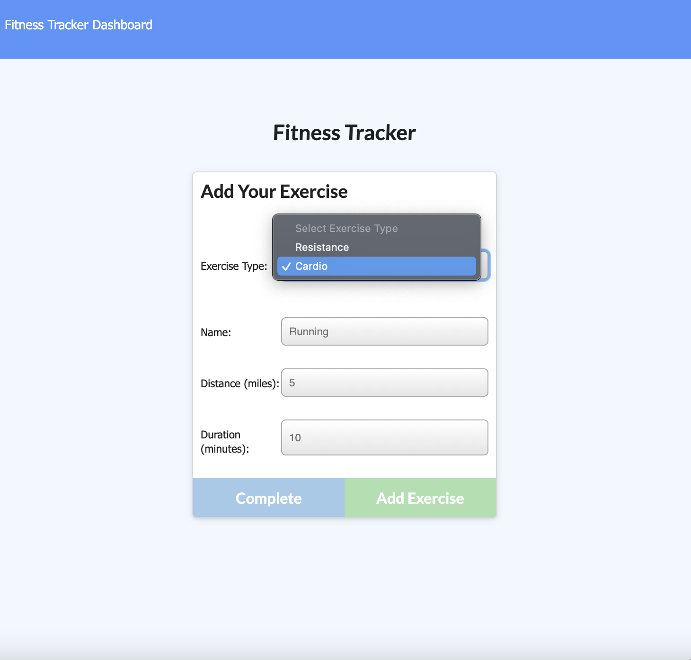
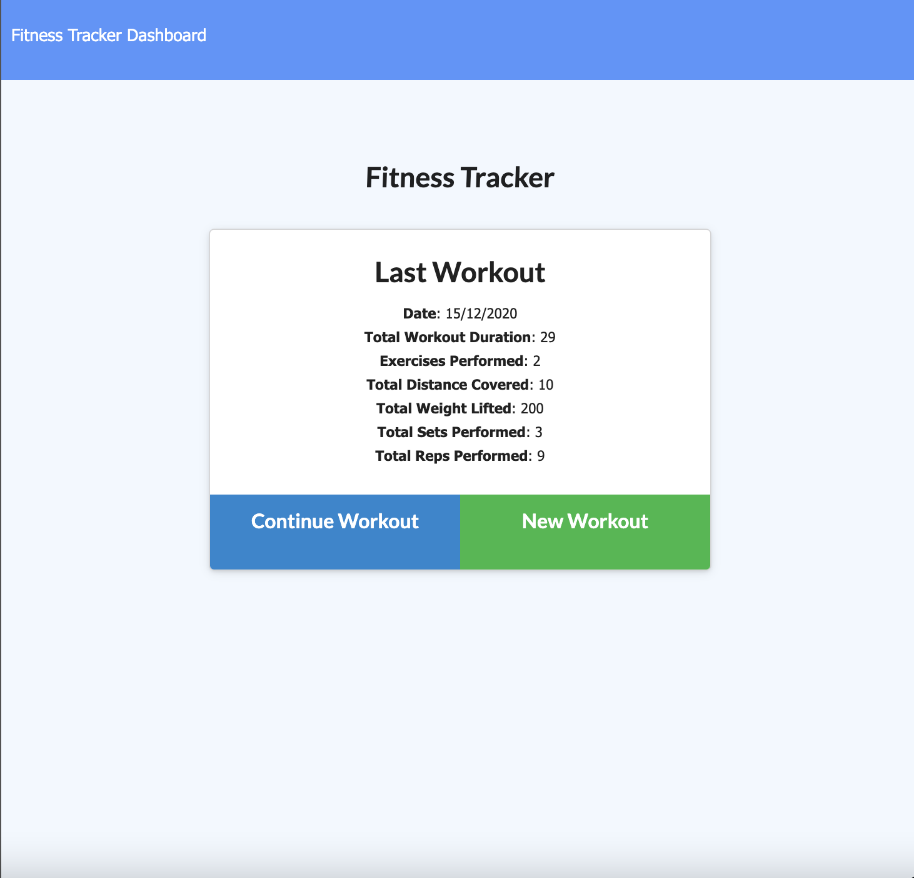
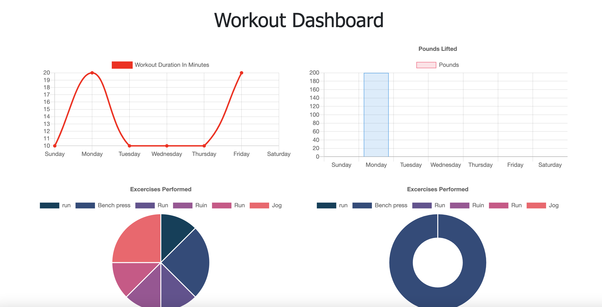

# Unit 17 Nosql Homework: Workout Tracker

### Licence

[](https://lbesson.mit-license.org/)

## Description

This application 'Workout Tracker' for people that want to make and view the work routines and stats.  Workout Tracker also allows them to track their workouts. A user will create and track daily workouts to  reach their fitness achievements  more quickly when they track their  progress.


## Table of Contents

[Installation](#installation)  
[Deployment](#deployment)  
[Screenshots](#screenshots)  
[License](#licenses)  
[Contributing](#contributing)                                                               
[Questions](#questions) 

## Installation

1. Create a MongoDB Atlas account
2. Clone this repo.

 ```
   git clone https://github.com/Michaelmw17/Workout-Tracker.git
   ```
   
2. Change to your own connection details in server.js and again in  seeders/seed.js.
3. Install all dependent npm packages

   ```
    npm i
   ```
   ```
    npm run seed
   ```


## Deployment

<a href="https://pure-gorge-67872.herokuapp.com/"> Workout Tracker App</a>

## Screenshots

             
                
               

## Licenses

[](http://unlicense.org/)<br />
## Contributing

Michael Watt </br>
<a href="https://www.trilogyed.com/"> Trilogy Education Services</a>

## Questions 

_Michael Watt_

- [Github!](https://github.com/Michaelmw17)
- [LinkedIn!](https://www.linkedin.com/in/michael-watt-6a76961b3/)
- [Portfolio!](http://michaelmw17.github.io/)

If you have any questions regarding this project
 - Email:(michaelmw17@outlook.com)
